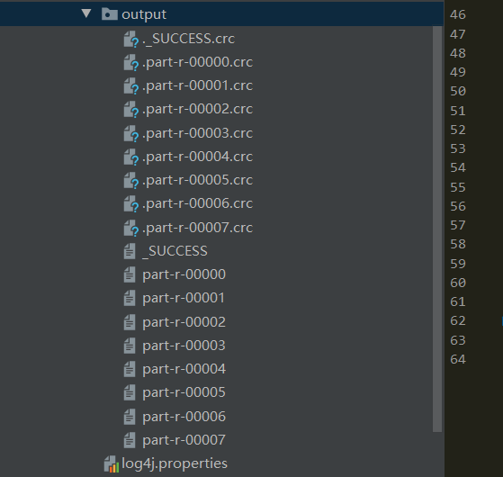
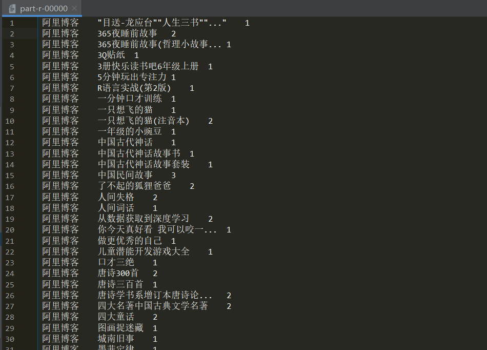

## Hadoop系统实践大作业

### 一、项目概述

现有图书订单表数据和商品类目表数据，先需要统计不同渠道图书销量数据，做成可视化报表，好让网站做更好的推荐服务。

### 二、设计过程

1. 自定义BookBean,实现WritableComparable<BookBean>

2. map阶段：

   + 读取product表，得到图书id和图书名，把他存入一个map里
   + 读取order表，填入各个字段，图书名由map通过id获取
   + 输出

3. 自定义分区：通过自定义的分区，来统计各个渠道图书的销量

4. reduce阶段

   - 通过计算amount得到图书的销量

   - 填入图书的各个字段，销量字段
   - 输出


### 三、结果





### 四、代码

#### BookBean

```java
import org.apache.hadoop.io.WritableComparable;
import java.io.DataInput;
import java.io.DataOutput;
import java.io.IOException;

/**
 * @Author Jiaman
 * @Date 2021/7/9 11:42
 * @Desc
 */

public class BookBean implements WritableComparable<BookBean> {
    private String bookId;
    private String bookName;
    private String channel;
    private long amount;


    public BookBean() {
    }

    public BookBean(String bookId, String bookName, String channel, long amount) {
        this.bookId = bookId;
        this.bookName = bookName;
        this.channel = channel;
        this.amount = amount;
    }

    public String getBookId() {
        return bookId;
    }

    public void setBookId(String bookId) {
        this.bookId = bookId;
    }

    public String getBookName() {
        return bookName;
    }

    public void setBookName(String bookName) {
        this.bookName = bookName;
    }

    public String getChannel() {
        return channel;
    }

    public void setChannel(String channel) {
        this.channel = channel;
    }

    public long getAmount() {
        return amount;
    }

    public void setAmount(long amount) {
        this.amount = amount;
    }

    @Override
    public String toString() {
        return  channel + "\t" + bookName + "\t" + amount ;
    }

    @Override
    public void write(DataOutput out) throws IOException {
        out.writeUTF(this.bookId);
        out.writeUTF(this.bookName);
        out.writeUTF(this.channel);
        out.writeLong(this.amount);
    }

    @Override
    public void readFields(DataInput in) throws IOException {
        this.bookId = in.readUTF();
        this.bookName = in.readUTF();
        this.channel = in.readUTF();
        this.amount = in.readLong();
    }


    @Override
    public int compareTo(BookBean o) {
        if (this.getAmount() > o.getAmount()) {
            return -1;
        } else if ((this.getAmount() < o.getAmount()) ){
            return 1;
        } else {
            return 0;
        }
    }
}

```

#### BookMapper

```java
import org.apache.commons.lang.StringUtils;
import org.apache.hadoop.fs.FSDataInputStream;
import org.apache.hadoop.fs.FileSystem;
import org.apache.hadoop.fs.Path;
import org.apache.hadoop.io.IOUtils;
import org.apache.hadoop.io.LongWritable;
import org.apache.hadoop.io.Text;
import org.apache.hadoop.mapreduce.Mapper;
import java.io.BufferedReader;
import java.io.IOException;
import java.io.InputStreamReader;
import java.net.URI;
import java.util.HashMap;
import java.util.Map;

/**
 * @Author Jiaman
 * @Date 2021/7/9 11:48
 * @Desc
 */

public class BookMapper extends Mapper<LongWritable, Text, Text, BookBean> {
    private Text k = new Text();
    private BookBean v = new BookBean();
    private Map<String, String> product = new HashMap<>();

    @Override
    protected void setup(Context context) throws IOException, InterruptedException {
       // 把图书类目表缓存到product
        URI[] cacheFiles = context.getCacheFiles();
        Path path = new Path(cacheFiles[0]);

        FileSystem fs = FileSystem.get(context.getConfiguration());
        FSDataInputStream fis = fs.open(path);

        // 包装成bufferedReader,方便进行按行读取
        BufferedReader bufferedReader = new BufferedReader(new InputStreamReader(fis, "UTF-8"));

        String line;
        while (StringUtils.isNotEmpty(line = bufferedReader.readLine())) {
            // 切割每一行
            String[] world = line.split(",");
            product.put(world[0], world[1]);
        }
        // 关流
        IOUtils.closeStream(bufferedReader);
    }

    @Override
    protected void map(LongWritable key, Text value, Context context) throws IOException, InterruptedException {
        // 读取订单表的数据
        String[] fields = value.toString().split(",");

        String bookName = product.get(fields[3]);

        if (bookName != null && !"null".equals(bookName)) {
            v.setBookId(fields[3]);
            v.setBookName(bookName);
            v.setChannel(fields[7]);
            v.setAmount(1);
            k.set(bookName);
        }


        context.write(k, v);
    }
}

```

#### ChannelPartition

```java
import org.apache.hadoop.io.LongWritable;
import org.apache.hadoop.io.Text;
import org.apache.hadoop.mapreduce.Partitioner;

/**
 * @Author Jiaman
 * @Date 2021/7/9 12:28
 * @Desc
 */

public class ChannelPartition extends Partitioner<Text, BookBean> {
    @Override
    public int getPartition(Text text, BookBean bookBean, int i) {

        String channel = bookBean.getChannel();

        int partition = 0;

        if ("阿里博客".equals(channel)) {
            partition = 0;
        } else if ("聚划算".equals(channel)) {
            partition = 1;
        } else if ("淘宝橱窗".equals(channel)) {
            partition = 2;
        } else if ("淘宝社区".equals(channel)) {
            partition = 3;
        } else if ("淘宝搜索".equals(channel)) {
            partition = 4;
        } else if ("淘宝直播".equals(channel)) {
            partition = 5;
        } else if ("直通车".equals(channel)) {
            partition = 6;
        }else if ("搜索".equals(channel)){
            partition = 7;
        }
        return partition;
    }
}

```

#### BookReducer

```java
import org.apache.hadoop.io.NullWritable;
import org.apache.hadoop.io.Text;
import org.apache.hadoop.mapreduce.Reducer;
import java.io.IOException;

/**
 * @Author Jiaman
 * @Date 2021/7/9 11:49
 * @Desc
 */

public class BookReducer extends Reducer<Text, BookBean, BookBean, NullWritable> {
    private BookBean k = new BookBean();

    @Override
    protected void reduce(Text key, Iterable<BookBean> values, Context context) throws IOException, InterruptedException {
        long sum = 0;
        for (BookBean value: values) {
            sum += value.getAmount();
            k.setBookId(value.getBookId());
            k.setBookName(value.getBookName());
            k.setChannel(value.getChannel());
        }

        k.setAmount(sum);


        context.write(k, NullWritable.get());
    }
}

```

#### BookDriver

```java
import org.apache.hadoop.conf.Configuration;
import org.apache.hadoop.fs.Path;
import org.apache.hadoop.io.NullWritable;
import org.apache.hadoop.io.Text;
import org.apache.hadoop.mapreduce.Job;
import org.apache.hadoop.mapreduce.lib.input.FileInputFormat;
import org.apache.hadoop.mapreduce.lib.output.FileOutputFormat;

import java.io.IOException;
import java.net.URI;
import java.net.URISyntaxException;

/**
 * @Author Jiaman
 * @Date 2021/7/9 11:49
 * @Desc
 */

public class BookDriver {
    public static void main(String[] args) throws InterruptedException, IOException, ClassNotFoundException, URISyntaxException {

        // 1 获取配置信息以及封装任务
        Configuration configuration = new Configuration();
        Job job = Job.getInstance(configuration);

        // 2 设置jar加载路径
        job.setJarByClass(BookDriver.class);

        // 3 设置map和reduce类
        job.setMapperClass(BookMapper.class);
        job.setReducerClass(BookReducer.class);

        // 4 设置map输出
        job.setMapOutputKeyClass(Text.class);
        job.setMapOutputValueClass(BookBean.class);

        // 5 设置最终输出kv类型
        job.setOutputKeyClass(BookBean.class);
        job.setOutputValueClass(NullWritable.class);

        // 设置分区类
        job.setPartitionerClass(ChannelPartition.class);

        // 设置reduce task个数
        job.setNumReduceTasks(8);

        // 加载缓存数据
        job.addCacheFile(new URI("file:///F:/Demo/bigdata/Book/src/main/resources/inputcache/product.csv"));

        // 6 设置输入和输出路径
        FileInputFormat.setInputPaths(job, new Path("F:\\Demo\\bigdata\\Book\\src\\main\\resources\\input\\order.csv"));
        FileOutputFormat.setOutputPath(job, new Path("F:\\Demo\\bigdata\\Top1Book\\src\\main\\resources\\output"));

        // 7 提交
        boolean result = job.waitForCompletion(true);

        System.exit(result ? 0 : 1);
    }
}

```


### 错误解决：

1. java.lang.NullPointerException出现的几种原因

```
1、字符串变量未初始化
2、接口类型的对象没有用具体的类初始化，比如：
Map map // 会报错
Map map = new Map(); //则不会报错了
3、当一个对象的值为空时，你没有判断为空的情况。
4、字符串与文字的比较，文字可以是一个字符串或Enum的元素，如下会出现异常
String str = null;
if（str.equals（“Test”））{
//这里的代码将不会被触发，因为会抛出java.lang.NullPointerException异常。
}
5、优先使用String.valueOf（）方法代替toString（）
当程序代码需要对象的字符串表示形式时，请避免使用该对象的toString方法。如果你的对象的引用等于null，NullPointerException则会抛出，使用静态String.valueOf方法，该方法不会抛出任何异常并打印"null"
6、class被声明了类型， 默认 class = null; 这样在调用class中方法的时候系统只能给你个空指针异常， 给其实例化就好了：class = new Class();
7、返回null，方法的返回值不要定义成为一般的类型，而是用数组。这样如果想要返回null的时候就能避免许多不必要的NullPointerException
```

2. java.lang.Exception: java.io.IOException: Illegal partition

   hadoop默认分区从0 开始

3. 分区分组

[Hadoop Mapreduce分区、分组、连接以及辅助排序（也叫二次排序）过程详解_键盘上舞动的青春-CSDN博客](https://blog.csdn.net/xiaocaidexuexibiji/article/details/12125699)

